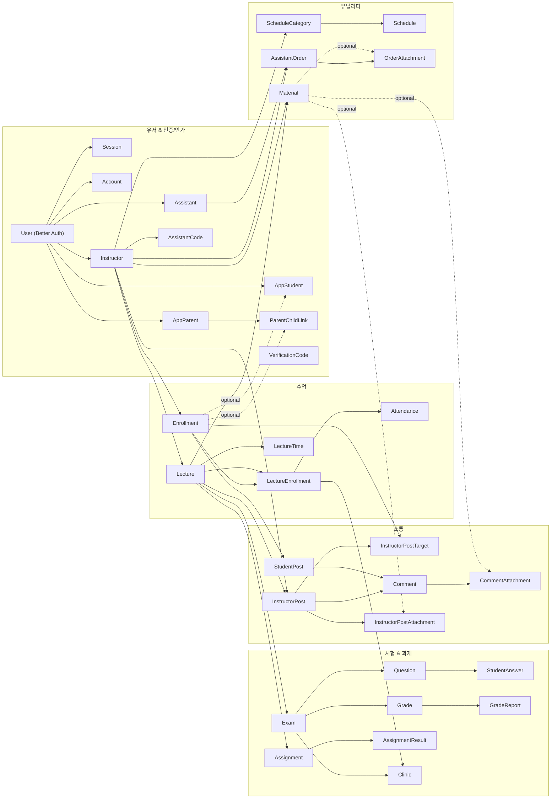

<div align="center">


# SSam B (ssambee.com)

**학원/수업 운영을 위한 통합 플랫폼**

여러 곳으로 흩어져있는 학원 강사를 위한 수업 관리 서비스를 하나로 모았습니다.<br>
수업 관리부터 성적 관리, 조교 업무 관리, 학생과의 소통까지 한 서비스에서 한 번에 해결할 수 있습니다.

|                                                                           프론트엔드                                                                            |                                                                            백엔드                                                                             |                                                              배포 링크                                                               |
| :-------------------------------------------------------------------------------------------------------------------------------------------------------------: | :-----------------------------------------------------------------------------------------------------------------------------------------------------------: | :----------------------------------------------------------------------------------------------------------------------------------: |
| [](https://github.com/EduOps-Lab/ssambee-fe) | [](https://github.com/EduOps-Lab/ssambee-be) | [](https://www.ssambee.com) |

## </div>

## 📋 목차

- [SSam B (ssambee.com)](#ssam-b-ssambeecom)
  - [](#)
  - [📋 목차](#-목차)
  - [✨ 주요 기능](#-주요-기능)
    - [👨‍🏫 강사 및 조교 (관리 영역)](#-강사-및-조교-관리-영역)
    - [🎓 학생 및 학부모 (서비스 영역)](#-학생-및-학부모-서비스-영역)
  - [🛠 기술 스택](#-기술-스택)
  - [📁 프로젝트 구조](#-프로젝트-구조)
    - [프론트엔드](#프론트엔드)
    - [백엔드](#백엔드)
    - [데이터베이스 (PostgreSQL)](#데이터베이스-postgresql)
    - [인프라 | 시스템 아키텍쳐](#인프라--시스템-아키텍쳐)
      - [BE](#be)
  - [🛸 팀 소개](#-팀-소개)

---

## ✨ 주요 기능


### 👨‍🏫 강사 및 조교 (관리 영역)

- **수업 관리:** 수업 개설, 수강생 등록 및 관리, 출결 관리
- **성적 관리:** 시험 등록 및 성적 입력, 성적 분석 및 리포트
- **조교 관리:** 조교 등록, 조교 업무 관리
- **업무 관리:** 스케줄 등록, 업무 자료실

### 🎓 학생 및 학부모 (서비스 영역)

- **내 수업 보기:** 수업 일정, 출결 현황, 성적 확인
- **소통 및 지원:** 공지사항, 학생 및 학부모 문의

---

## 🛠 기술 스택

| 분류         | 스택                                                                                                                                                                                                                                                                                                                                                                                                                                                                                                                                                                                                                                                                                                                                                                                        |
| ------------ | ------------------------------------------------------------------------------------------------------------------------------------------------------------------------------------------------------------------------------------------------------------------------------------------------------------------------------------------------------------------------------------------------------------------------------------------------------------------------------------------------------------------------------------------------------------------------------------------------------------------------------------------------------------------------------------------------------------------------------------------------------------------------------------------- |
| **Frontend** |        |
| **Backend**  |                                                                                                                                     |
| **Database** |                                                                                                                                                                                                                                                                                                                                                                                                                                                                                                                                                                                                                                                                            |
| **Infra**    |                                                                                                                                                     |

---

## 📁 프로젝트 구조

### 프론트엔드

Next.js App Router 기반으로 UI 컴포넌트와 비즈니스(통신/상태) 로직을 명확히 분리하여 재사용성과 유지보수성을 높인 구조입니다.

```text
src/
├── app/                    # 🚀 Next.js App Router (페이지 및 라우팅)
├── components/             # 🧩 공용 컴포넌트 (ui는 shadcn/ui)
├── services/               # 🔌 API 클라이언트 및 도메인 로직 (Mapper 포함)
├── providers/              # 🛡️ React Context Providers (Query, Auth 등)
├── stores/                 # 📦 Zustand 상태 관리
├── hooks/                  # 🎣 재사용 가능한 커스텀 훅
├── types/                  # 📝 TypeScript 타입 정의
├── validation/             # ✅ Zod 스키마 및 폼 검증
├── utils/                  # 🛠️ 유틸리티 함수
└── constants/              # 📌 상수 정의
```

### 백엔드

Express와 Prisma 기반의 3계층 아키텍쳐(Controller - Service - Repository)와 의존성 주입(DI) 패턴을 적용하여, 로직의 응집도를 높이고 테스트 용이성과 유지보수성을 극대화한 구조입니다.

```text
src/
├── app.ts                  # 🚀 앱 부팅, 라우팅 및 서버 종료 제어
├── config/                 # ⚙️ 환경 변수, DB, Redis, Auth 설정
├── routes/                 # 🛤️ 엔드포인트 라우팅 (mgmt, svc, public)
├── controllers/            # 🎮 HTTP 요청 및 응답 제어
├── services/               # 💼 비즈니스 로직
├── repos/                  # 🗄️ Prisma 기반 데이터 접근(Repository)
├── validations/            # ✅ Zod 기반 요청 데이터 검증
├── middlewares/            # 🛡️ 인증, 로깅, 에러 핸들링 등 미들웨어
└── utils/                  # 🛠️ 공용 유틸리티 (메일, 모니터링 등)
prisma/
└── schema.prisma           # 📝 DB 스키마 및 모델 정의
```

### 데이터베이스 (PostgreSQL)

총 40여 개의 테이블을 **5개의 핵심 비즈니스 도메인**으로 분류하여 관리합니다. 데이터 무결성과 접근성을 고려하여 외래키(FK)와 인덱스를 최적화했습니다.

<details>
<summary><strong>👉 데이터베이스 도메인 다이어그램 펼쳐보기</strong></summary>
<br>



</details>

<br>

| 도메인               | 핵심 역할                                                 | 주요 테이블 (Root)                              |
| -------------------- | --------------------------------------------------------- | ----------------------------------------------- |
| **유저 & 인증/인가** | Better Auth 기반 로그인 세션 및 사용자 식별 프로필 분리   | `User`, `Instructor`, `AppStudent`, `AppParent` |
| **수업**             | 강사-학생 간 명부(Enrollment) 및 실제 수강/출결 연결      | `Enrollment`, `Lecture`, `LectureEnrollment`    |
| **시험 & 과제**      | 문항/답안 생성, 성적/리포트 산출 및 보완학습(클리닉) 운영 | `Exam`, `Grade`, `Assignment`, `Clinic`         |
| **소통**             | 게시글/질문/댓글 운영 및 선택 수신함 구성                 | `InstructorPost`, `StudentPost`, `Comment`      |
| **유틸리티**         | 캘린더 일정 관리, 업무용 자료실(허브), 조교 업무 지시     | `Material`, `Schedule`, `AssistantOrder`        |

### 인프라 | 시스템 아키텍쳐

#### BE

- **[AWS BE SYSTEM ARCHITECTURE]**
  

- **[Deep Dive]** **(Made by IcePanel C4 Model)**

> _"Blue-Green 배포 로직과 Lambda 기반 모니터링은 아래의 논리적 아키텍처를 따릅니다."_
> 

---

## 🛸 팀 소개

|                   👑 박창기                    |                    이유리                    |                          임경민                           |                     김윤기                      |
| :--------------------------------------------: | :------------------------------------------: | :-------------------------------------------------------: | :---------------------------------------------: |
|  |  |  |  |
|                  PM & 프론트                   |                    프론트                    |                          백엔드                           |                  백엔드 & 배포                  |

## <!-- ## 📌 프로젝트 계획 -->

<div align="center">

**Made with ❤️ by SSam B Team**

</div>
